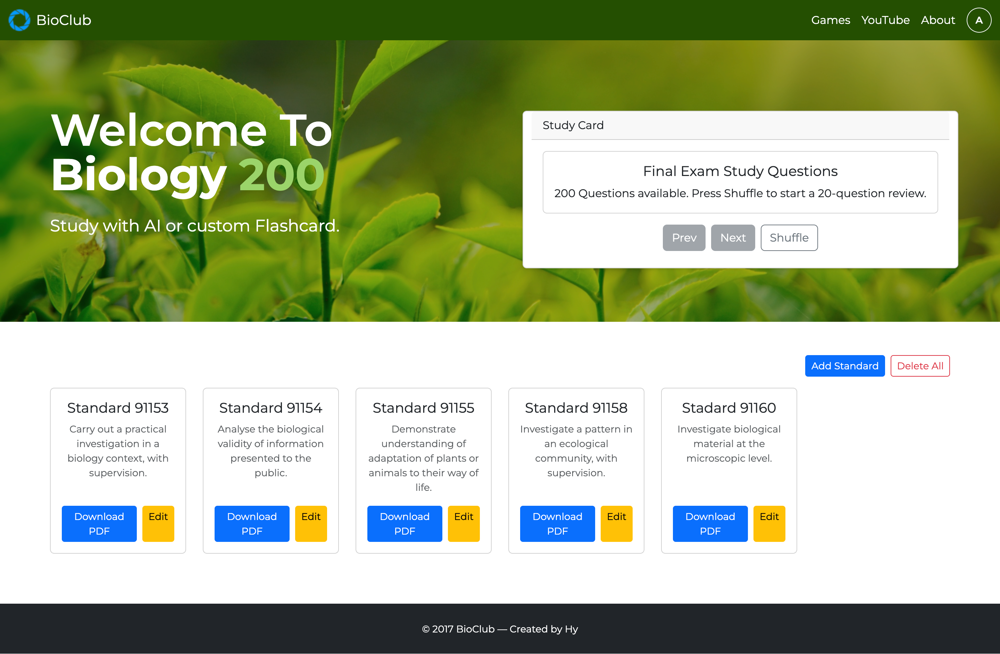
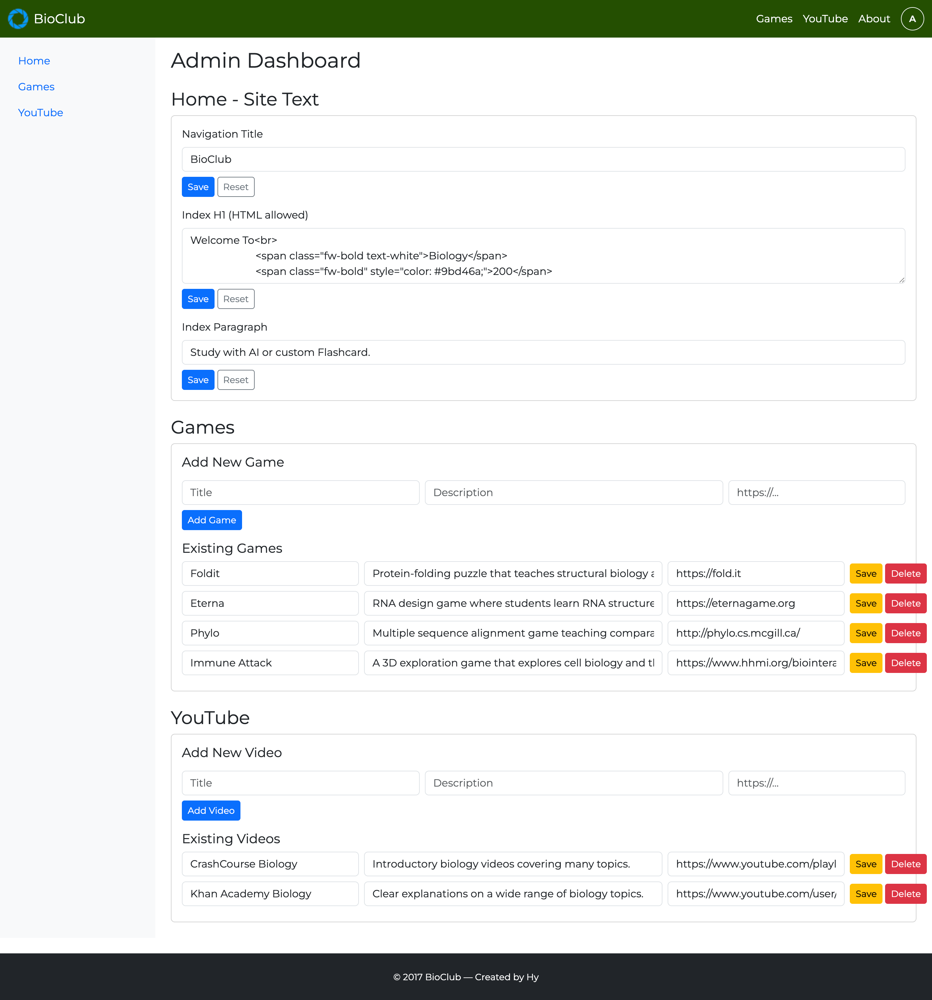

# BioClub

Repository: BioClub — web application (Spring Boot + Thymeleaf)

## System Overview

Purpose: Quiz Platform for NCEA Level 2 Biology.
Primary users: students, teachers, admins.
Key technologies: Java 21, Spring Boot, Spring Data JPA, Thymeleaf, MySQL.

## System Context

External systems:
- Browser clients (desktop / mobile)
- Optional YouTube embeds for video content
- Persistent RDBMS (MySQL)


## Architecture Overview

Architectural style: layered monolith (MVC)
- Presentation: Thymeleaf templates + static assets
- Controllers: page controllers and JSON endpoints
- Services: domain logic and orchestration
- Repositories: Spring Data JPA
Rationale: small scope, single deployable unit, easy CI/CD and testing.

## Project Structure

Tree (concise):
```text
.
├─ pom.xml
├─ src/
│  ├─ main/
│  │  ├─ java/com/hy/BioClub/
│  │  │  ├─ BioClubApplication.java
│  │  │  ├─ config/
│  │  │  ├─ controller/
│  │  │  ├─ model/
│  │  │  ├─ repository/
│  │  │  └─ service/
│  │  └─ resources/
│  │     ├─ templates/
│  │     └─ static/
│  └─ test/
└─ README.md
```

Main packages:

| Package | Responsibility |
|---|---|
| `controller` | HTTP endpoints (pages & API) |
| `model` | JPA entities and domain objects |
| `repository` | Data access via Spring Data |
| `service` | Business logic, orchestration |
| `config` | Application configuration & data loader |

## Development Setup

Prereqs: JDK 21, Maven, Git.

Quick start:
```bash
git clone <repo>
cd BioClub
./mvnw spring-boot:run
# or build
./mvnw clean package
java -jar target/BioClub-0.0.1-SNAPSHOT.jar
```

## Recent additions (summary)

- Admin dashboard: visit `/admin` to manage site text and content.
	- Edit navigation title, the index H1 (HTML allowed) and index paragraph.
	- CRUD for Games and YouTube lists (add / edit / delete entries).
- Standards management:
	- Add/edit/delete individual standards (via UI).
	- "Delete All" button on home page removes all standards.
- Templates refactor:
	- `fragments/head.html` and `fragments/header.html` created and used by `index.html`, `games.html`, and `youtube.html`.
	- `index.html`, `games.html`, `youtube.html` now render dynamic content via services (`SiteConfigService`, `GamesService`, `YoutubeService`).
- YouTube page uses a Bootstrap 5 carousel populated from the `YoutubeService` list; admin controls manage the list.
- UI tweaks:
	- Admin avatar added to navbar linking to `/admin`.
	- Carousel control icons set to dark for light backgrounds (see `src/main/resources/static/css/style.css`).

## Visual



